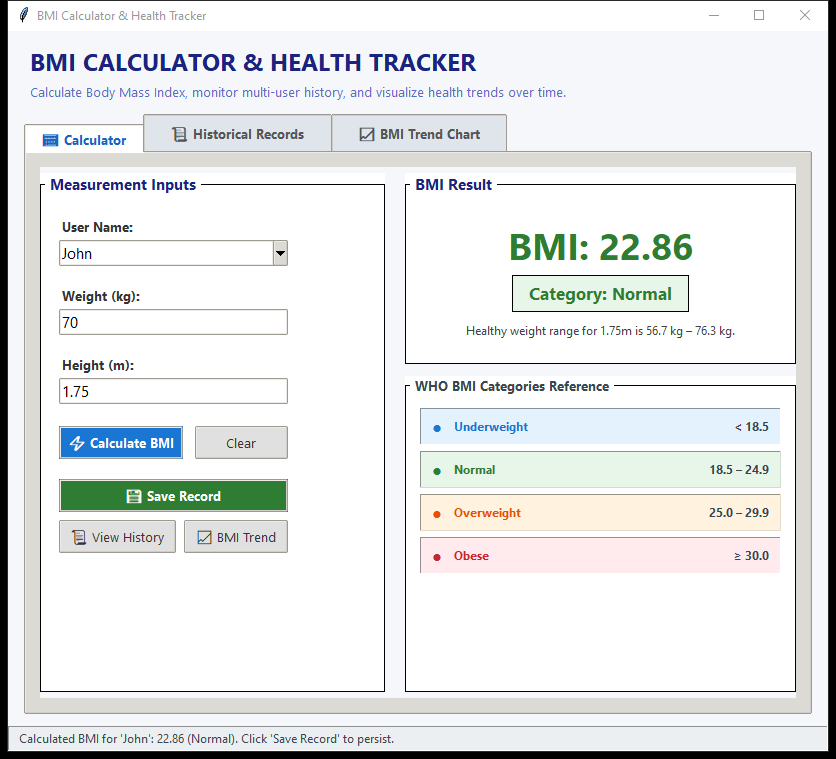
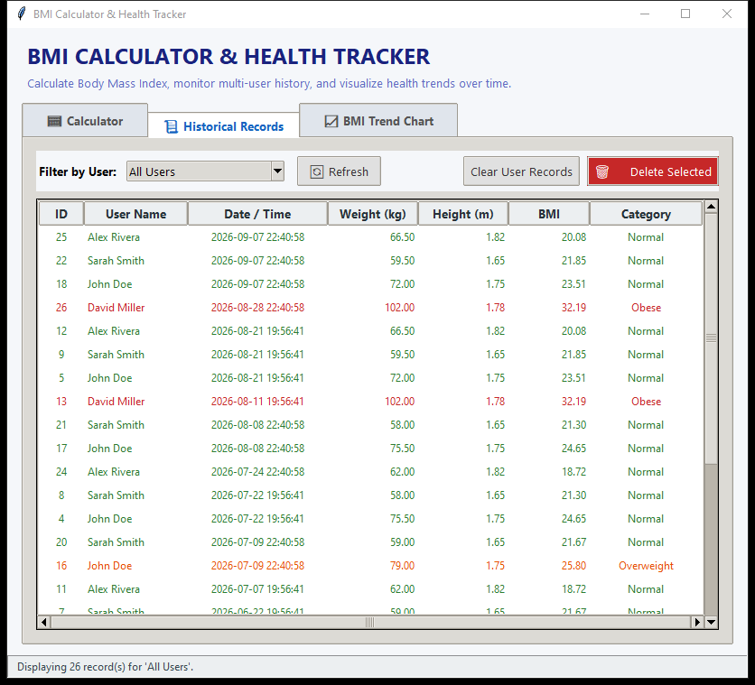
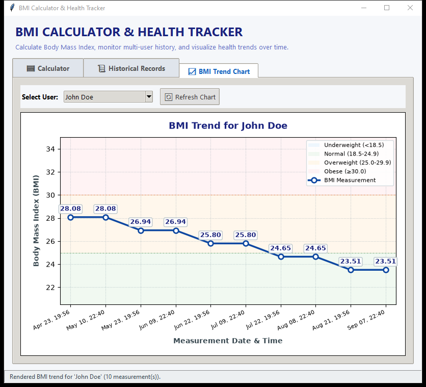
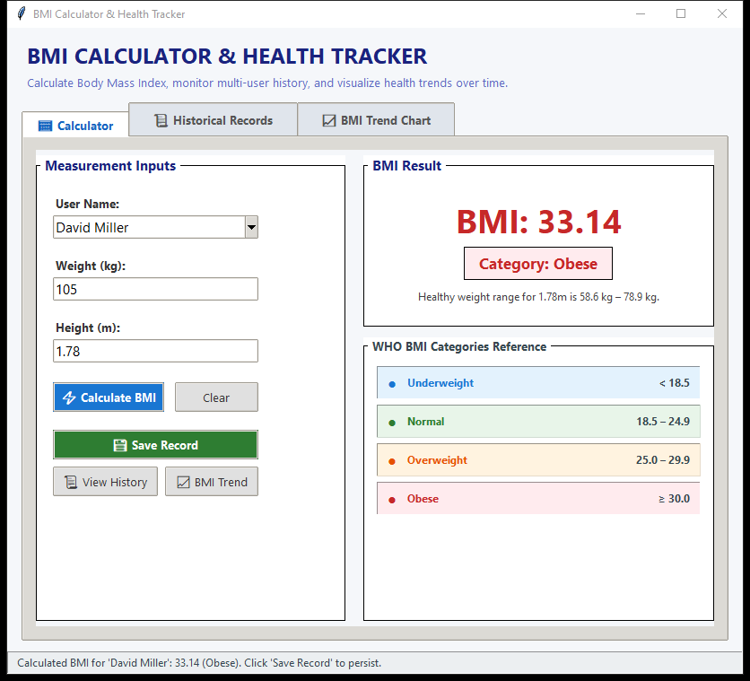

# BMI Calculator & Health Tracker

A modern, production-quality desktop application built with **Python 3**, **Tkinter**, **SQLite3**, and **Matplotlib**. It enables users to calculate their Body Mass Index (BMI), obtain immediate color-coded health categorization, maintain multi-user measurement histories, and visualize longitudinal health trends interactively.

---

## Table of Contents

- [Overview](#overview)
- [Key Features](#key-features)
- [Architecture & Tech Stack](#architecture--tech-stack)
- [BMI Calculation & Classification](#bmi-calculation--classification)
- [Project Structure](#project-structure)
- [Installation Guide](#installation-guide)
- [Running the Application](#running-the-application)
- [Application Walkthrough & Features](#application-walkthrough--features)
  - [1. Calculator Tab](#1-calculator-tab)
  - [2. Historical Records Tab](#2-historical-records-tab)
  - [3. BMI Trend Chart Tab](#3-bmi-trend-chart-tab)
- [Database Schema & Persistence](#database-schema--persistence)
- [Input Validation & Error Handling](#input-validation--error-handling)
- [Automated Testing](#automated-testing)
- [Troubleshooting](#troubleshooting)
- [Future Enhancements](#future-enhancements)

---

## Overview

Body Mass Index (BMI) is a standardized screening metric used globally to categorize weight status in adults. This application provides an accessible, standalone desktop interface designed for individuals, trainers, and healthcare practitioners to track BMI changes accurately over time with zero command-line interaction required for day-to-day use.

---

## Key Features

- **Accurate Mathematical Calculations**: Precise BMI computation rounded to 2 decimal places using standard WHO formulas.
- **Color-Coded Visual Feedback**: Distinct, accessible color badges and text feedback indicating Underweight (Blue), Normal (Green), Overweight (Orange), and Obese (Red).
- **Multi-User Isolation**: Supports multiple independent profiles (e.g., John, Sarah, Alex) without data bleed.
- **Embedded SQLite Storage**: Automatic database initialization (`bmi_records.db`) with parameterized queries preventing SQL injection and connection leaks.
- **Historical Record Management**: View historical measurements in an interactive `ttk.Treeview` table with sorting, filtering, single-record deletion, and bulk user clearing.
- **Interactive Trend Charts**: Embedded Matplotlib line charts (`FigureCanvasTkAgg`) with reference threshold bands, data point annotations, and automated timeline scaling.
- **Robust Input Validation**: Immediate rejection and clear messaging for empty strings, non-numeric characters, negative numbers, and zeros.
- **Comprehensive Test Coverage**: Automated pytest test suite covering unit logic, database CRUD operations, and GUI workflows.

---

## Architecture & Tech Stack

- **Language**: Python 3.8+ (tested on Python 3.12)
- **GUI Toolkit**: Tkinter & `ttk` (Native Python standard library)
- **Data Visualization**: Matplotlib (`FigureCanvasTkAgg` backend)
- **Persistence Engine**: SQLite3 (`sqlite3` standard library module)
- **Date & Time Tracking**: Python `datetime` module
- **Testing**: `pytest` and `unittest.mock`

---

## BMI Calculation & Classification

### Formula

$$\text{BMI} = \frac{\text{Weight (kg)}}{(\text{Height (m)})^2}$$

In Python:
```python
bmi = weight / (height ** 2)
```

### Standard WHO Categories & Thresholds

| Category | BMI Range | Color Code | Hex Code | UI Badge Style |
| :--- | :--- | :--- | :--- | :--- |
| **Underweight** | $< 18.5$ | Blue | `#1976D2` | Light Blue Background (`#E3F2FD`) |
| **Normal** | $18.5 - 24.9$ | Green | `#2E7D32` | Light Green Background (`#E8F5E9`) |
| **Overweight** | $25.0 - 29.9$ | Orange | `#E65100` | Light Orange Background (`#FFF3E0`) |
| **Obese** | $\ge 30.0$ | Red | `#C62828` | Light Red Background (`#FFEBEE`) |

### Boundary Rules
- $18.49 \rightarrow$ **Underweight**
- $18.50 \rightarrow$ **Normal**
- $24.99 \rightarrow$ **Normal**
- $25.00 \rightarrow$ **Overweight**
- $29.99 \rightarrow$ **Overweight**
- $30.00 \rightarrow$ **Obese**

---

## Project Structure

```text
lucid-tesla/
│
├── bmi_logic.py          # Business logic: calculation, WHO classification, input validation
├── database.py           # SQLite persistence layer: schema setup, parameterized CRUD, error handling
├── gui.py                # Tkinter GUI: layouts, styling, Treeview history, Matplotlib canvas
├── main.py               # Application entry point and window lifecycle manager
├── seed_sample_data.py   # Utility to seed realistic demonstration records
├── requirements.txt      # External dependencies (matplotlib)
├── README.md             # Complete user and developer documentation
├── bmi_records.db        # SQLite database (auto-generated on startup)
│
└── tests/
    ├── __init__.py
    ├── test_bmi_logic.py # Unit tests for math, boundaries, and validation
    ├── test_database.py  # Unit tests for SQLite schema, queries, multi-user isolation
    └── test_gui.py       # Integration tests for GUI events, history, and plotting
```

---

## Installation Guide

### 1. Prerequisites
Ensure you have Python 3.8 or higher installed on your system. Verify with:
```bash
python --version
```

### 2. Clone / Open the Project
Navigate to the project directory:
```bash
cd lucid-tesla
```

### 3. Install Dependencies
Install the required external packages using pip:
```bash
python -m pip install -r requirements.txt
```

> **Note**: `tkinter` and `sqlite3` are part of the standard Python installation on Windows and macOS. On certain Linux distributions (like Ubuntu/Debian), you may install Tkinter via:
> ```bash
> sudo apt-get install python3-tk
> ```

---

## Running the Application

Launch the desktop interface by executing:
```bash
python main.py
```

### Optional: Populating Sample Data
To explore the application with pre-populated realistic multi-user records and historical trends:
```bash
python seed_sample_data.py
```
This adds 13 realistic records across 4 diverse user profiles (weight loss journey, weight maintenance, muscle gain progression, and single-record baseline).

The application window will automatically center on your screen and initialize the local database (`bmi_records.db`) if it does not already exist.

---

## Application Walkthrough & Features

### 1. Calculator Tab
1. **User Name**: Select an existing user from the dropdown or type a new name (e.g., `John Doe`).
2. **Weight (kg)**: Enter weight in kilograms (e.g., `72.5`).
3. **Height (m)**: Enter height in meters (e.g., `1.75`).
4. **Calculate BMI**: Click `⚡ Calculate BMI` or press <kbd>Enter</kbd>.
   - The result card displays the exact BMI rounded to 2 decimal places (e.g., `BMI: 22.86`).
   - The category badge highlights the classification in its distinct color (e.g., `Category: Normal`).
   - Displays healthy weight range context for the given height.
5. **Save Record**: Click `💾 Save Record` to record the calculation timestamped in SQLite.
6. **Clear**: Reset input fields and calculation state.



### 2. Historical Records Tab
- View a structured table of past measurements with columns: **ID**, **User Name**, **Date / Time**, **Weight (kg)**, **Height (m)**, **BMI**, and **Category**.
- **Filter by User**: Use the dropdown filter to view records for a specific individual or view `All Users`.
- **Delete Selected**: Select any record in the table and click `🗑️ Delete Selected` to remove it.
- **Clear User Records**: Purge all historical records for the currently selected user with confirmation.



### 3. BMI Trend Chart Tab
- Choose a user from the dropdown selector.
- The interactive Matplotlib chart plots:
  - **X-axis**: Timestamp of each measurement.
  - **Y-axis**: Body Mass Index (BMI).
  - **WHO Category Bands**: Translucent colored background zones denoting Underweight, Normal, Overweight, and Obese ranges.
  - **Trend Progression**: Solid line with circular markers and numerical value labels at each data point.
- **Zero Records**: Displays a friendly placeholder message guiding the user to record data.
- **Single Record**: Plots a single prominent marker with reference scales.
- **Multiple Records**: Generates a continuous historical progression line.



### 4. Dynamic Color Feedback Across Categories
The interface dynamically adapts color badges and text feedback based on the WHO classification:



---

## Database Schema & Persistence

The application utilizes SQLite with the following schema:

```sql
CREATE TABLE IF NOT EXISTS bmi_records (
    id INTEGER PRIMARY KEY AUTOINCREMENT,
    user_name TEXT NOT NULL,
    weight REAL NOT NULL,
    height REAL NOT NULL,
    bmi REAL NOT NULL,
    category TEXT NOT NULL,
    recorded_at TEXT NOT NULL
);

CREATE INDEX IF NOT EXISTS idx_user_name ON bmi_records (user_name);
```

### Safety & Integrity Practices:
- **Parameterized SQL**: All insert, select, and delete queries use `?` parameter substitution, preventing SQL injection vulnerabilities.
- **Connection Context Management**: Database connections use context managers ensuring automatic transactions, commit on success, and safe closure.
- **Custom Exception Handling**: SQLite errors are caught and surfaced via `DatabaseError` to display friendly GUI dialogs rather than crashing the runtime.

---

## Input Validation & Error Handling

The application features strict defensive input validation:

| Input Scenario | Validation Action | User-Facing Message |
| :--- | :--- | :--- |
| Empty User Name | Rejected | `"Please enter a valid user name."` |
| Whitespace-only User Name | Trimmed & Rejected | `"Please enter a valid user name."` |
| Non-numeric Weight (`"abc"`) | Rejected | `"Please enter a valid weight."` |
| Zero Weight (`0`) | Rejected | `"Weight must be greater than zero."` |
| Negative Weight (`-70`) | Rejected | `"Weight must be greater than zero."` |
| Non-numeric Height (`"xyz"`) | Rejected | `"Please enter a valid height."` |
| Zero Height (`0`) | Rejected (Div-by-Zero prevention) | `"Height must be greater than zero."` |
| Negative Height (`-1.75`) | Rejected | `"Height must be greater than zero."` |
| Extreme Out-of-Bounds | Rejected | `"Weight/Height entered exceeds realistic limits."` |

---

## Automated Testing

To run the automated test suite with pytest:

```bash
python -m pytest -v
```

### Test Suite Summary
- `tests/test_bmi_logic.py`: 16 tests covering calculation accuracy, WHO boundary conditions, healthy range estimation, and validation rules.
- `tests/test_database.py`: 8 tests covering schema initialization, CRUD operations, multi-user isolation, and error handling.
- `tests/test_gui.py`: 7 integration tests verifying Tkinter widgets, event triggers, database synchronization, Treeview table rendering, and Matplotlib chart generation.

All 41 tests execute and pass out-of-the-box.

---

## Troubleshooting

1. **`ModuleNotFoundError: No module named 'matplotlib'`**
   - Run `python -m pip install -r requirements.txt`.
2. **`ModuleNotFoundError: No module named 'tkinter'` on Linux**
   - Install Tkinter via your distribution package manager: `sudo apt-get install python3-tk` (Ubuntu/Debian) or `sudo dnf install python3-tkinter` (Fedora).
3. **Database locked or inaccessible**
   - Ensure the directory where the application is run has write permissions. The database file `bmi_records.db` will be created in the current working directory.

---

## Future Enhancements

- Export historical records to CSV or PDF report format.
- Support for imperial units (lbs, feet/inches) with automatic metric conversion.
- Target BMI goal setting and progress indicators.
- User profile avatars and age/gender demographic adjustments.
